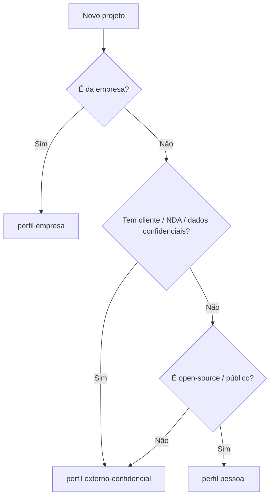

<!-- Caminho relativo: docs/comparativo-perfis.md -->

# Comparativo dos perfis de uso de agentes de IA

Os três perfis compartilham o **mesmo desenvolvedor, ambiente e estilo de codificação** —
mudam essencialmente na **postura de confidencialidade, infraestrutura disponível e
licenciamento**. Tudo o que é comum vive nas seções 1–5 e 8 de cada `AGENTS.md`; as
diferenças concentram-se nas seções 0, 6, 7 e na documentação do projeto.

## Como escolher

## Matriz de diferenças

| Dimensão | **empresa** | **externo-confidencial** | **pessoal** |
|---|---|---|---|
| Confidencialidade | Crítica (dados proprietários) | Alta (NDA do cliente) | Relaxada (código público) |
| Modelos/dados | API corporativa aprovada / modelos locais; **proibido** enviar dados proprietários/sensíveis a terceiros | APIs comerciais **com opt-out de retenção**; dados do cliente = sensíveis | APIs na nuvem livres; só não vazar segredos |
| Cofre de segredos | Vault/OpenBao/Azure KV + auditoria e rotação | Doppler/Infisical/1Password (equipe pequena) | Cofre leve; `.env` local no `.gitignore` global |
| Sandbox / permissões | **Obrigatória**; `--dangerously-skip-permissions` proibido | Recomendada/obrigatória | Recomendada |
| `.claude` defaultMode | `default` | `default` | `acceptEdits` |
| Licença | Proprietária / interna | Conforme contrato do cliente | MIT/Apache/GPL + seção **Apoie** |
| Revisão de PR | Humana obrigatória + SAST/SCA/**SBOM** | Humana obrigatória | Revisão + secrets scan pré-commit |
| README/CHANGELOG público | Não | Não | **Sim** (badges, contribuição, Apoie) |
| Handoff `CURRENT-STATE.md` | Obrigatório | Obrigatório | Opcional (recomendado em colab.) |
| Proveniência (modelo/prompt em commit) | Obrigatória | Conforme contrato | Leve |

## O que é idêntico nos três

- Ambiente: WSL2/Ubuntu 24, zsh, uv, git, VSCode, Docker.
- Estilo: comentário de caminho relativo, Doxygen, Type Hints, formatadores
  (`clang-format`/`black`+`isort`/`rustfmt`/`prettier`), Markdown+Mermaid+LaTeX, *diff* git.
- Higiene de sessão: comunicação sintética, poda de sessão, fluxo híbrido por tarefa,
  parâmetros econômicos em `.claude/settings.json`.
- Os quatro princípios de não-exposição de segredos (skill `secrets-guard`).
- Skills de governança disponíveis (instaladas em `.claude/skills/`).
