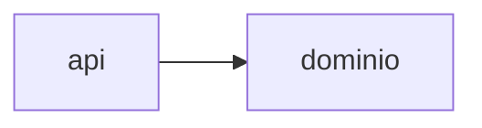

<!-- Caminho relativo: docs/architecture.md -->

# Arquitetura

> Arquitetura **efetiva**, derivada das dependências reais entre módulos — não a desejada.
> Atualize no mesmo trabalho que mudar módulos ou dependências (skill `mapa-de-arquitetura`).

## Visão geral

_(três a cinco linhas: o que o sistema faz, por onde entra a execução, onde fica o estado.)_

## Componentes

| Componente | Caminho | Responsabilidade (pelo que o código faz) |
|---|---|---|
| `api` | `src/api/` | Recebe requisições HTTP e delega ao domínio |

## Dependências

| De → Para | Natureza | Evidência |
|---|---|---|
| `api` → `dominio` | chamada direta | 14 imports em `src/api/` |

## Diagrama

## Desvios e pontos de atenção

_(ciclos, dependência no sentido inesperado, módulo que todos importam, código sem dono ou
aparentemente morto — registrados, não corrigidos.)_

## Como este mapa foi gerado

- Comando: `...`
- Data: AAAA-MM-DD · Commit: `...`
